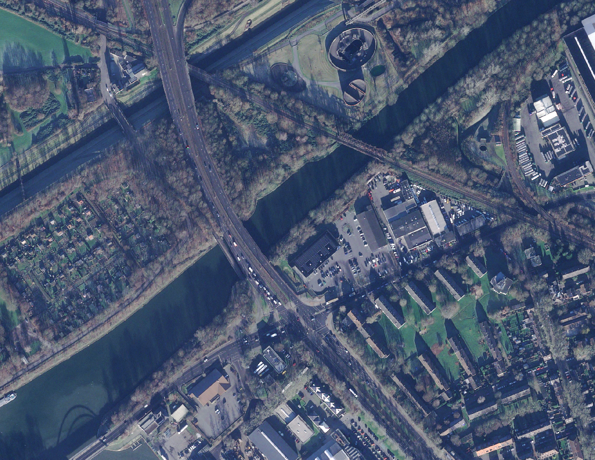
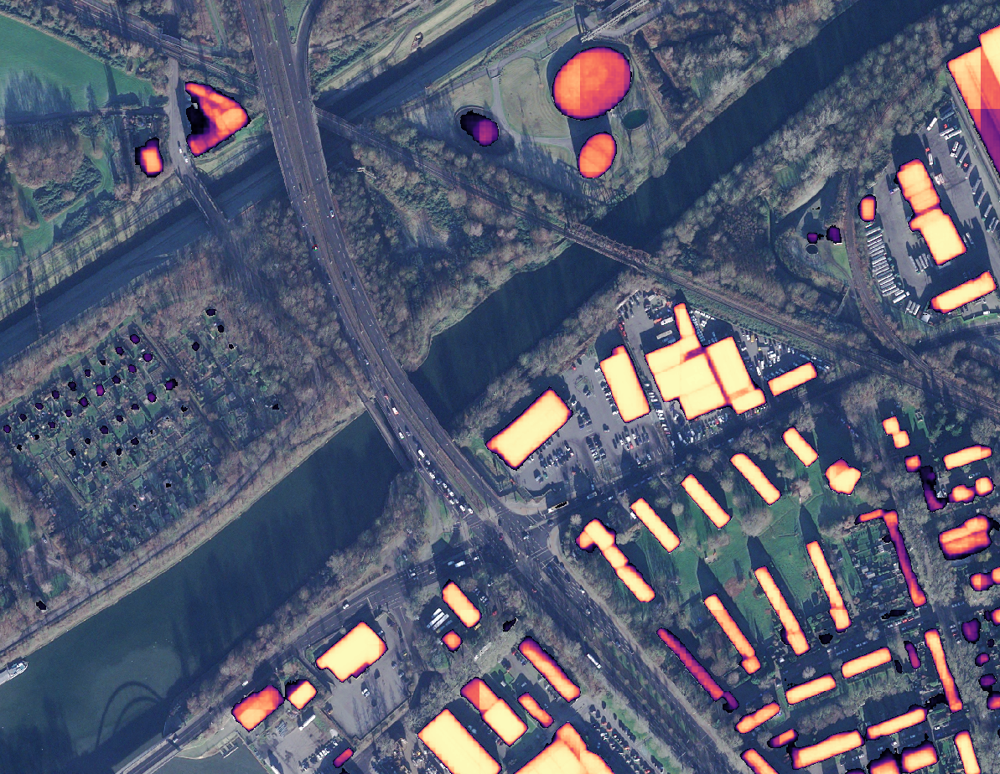

# BuildingSAM: Building Detection Pipeline for Aerial Imagery  


**BuildingSAM** is a processing pipeline for 3-channel remote sensing data, paired with a pre-trained **Segment Anything Model (SAM) LoRA-Adapter** optimized for building detection in aerial imagery with a 10-50cm (30cm best) Ground Sampling Distance (GSD). The pipeline is fully configurable via a YAML file for reproducibility and ease of use.

For details about SAM fine-tuning with LoRA-Adapters, see [Mathieu's repository](https://github.com/MathieuNlp/Sam_LoRA/tree/main).

## 🚀 Key Features  

- **End-to-end processing**: Preprocessing, training, inference, and postprocessing  
- **LoRA-Adapter**: Efficient SAM fine-tuned adapter (rank=512) for building detection  
- **Training Augmentation**: 7 augmentations for training  
- **Test-Time Augmentation (TTA)**: 3 geometric augmentations for inference
- **Configurable workflows**: Define workflows via YAML  

<p float="left">


</p>
---

## 📥 Installation

### 1. Prerequisites  
Download the SAM weights (only ViT-B tested, therefore recommended) from [Meta AI's official repository](https://github.com/facebookresearch/segment-anything?tab=readme-ov-file#model-checkpoints) or execute the following command in your terminal:
```
wget https://dl.fbaipublicfiles.com/segment_anything/sam_vit_b_01ec64.pth
```

Place the downloaded weights in a directory. 
Note that these weights are licensed by Meta AI under the Apache 2.0 License

Download the LoRA-adapter checkpoint file if you want to detect buildings in 3-channel aerial imagery from [here](https://geodata.gelsenkirchen.de/medien/_Dokumente/buildingSAM/buildingSAM_R512.safetensors) or execute the following command in your terminal:
```
wget https://geodata.gelsenkirchen.de/medien/_Dokumente/buildingSAM/buildingSAM_R512.safetensors
```

### 2. Install Dependencies  
You can install necessary modules via pip or conda. Conda is recommended.

#### pip  
```
pip install -r requirements.txt
```

#### conda  

```
conda create --name env_name python=3.10 -y
conda activate env_name

# Choose either pip or conda for package installation:
pip install -r requirements.txt 
# OR 
conda install --yes --file requirements.txt
```

---

## 🛠️ Usage

GE-SAM offers 4 different processing stages. Parameters for all stages are set in a YAML configuration file (see ./examples/exampleConfig.yaml).

❗**Important**:
- Backslashes in the configuration file will cause errors

### 0. Global

`image_format` defines the file extension used for searching image files in input folders and writing files to disk.

```
image_format: ".tif" # (optional; .tif by default)
```

### 1. Preprocessing

The preprocessing stage allows buffering, tiling and resampling images of a given `image_format` inside the specified `image_dir` and `target_dir`. `buffer_size` defines the width of the buffer in pixels around each input image (padded with 0s) and `step_size` the stepping size in pixels in x- and y-direction when tiling. `resample_size` lets you define the new size in image units of the preprocessed output (e.g. 0.3 → 30cm in EPSG 25832). By default, empty images are discarded and not written to disk. Set keep_empty accordingly.

If you want to prevent tiles from overlapping, you can set `step_size` equal to 1024 (SAM's native input size). If your input images are not resized to shape 1024x1024, SAM will do so automatically, which will lead to an increased processing time and generally worse results.

If you want to train a model and you are using the preprocessing stage for your training images, you'll also need to define a `target_dir` to preprocess your targets simultaneously OR run the preprocessor twice, each time with a different `image_dir`.

**Preprocessor Configuration**
```
preprocessor:
  buffer_size: 512     # (optional; 0 by default) 
  step_size: 256       # (optional: 1024 by default) 
  resample_size: 0.5   # (optional: 0.3 by default) 
  keep_empty: true     # (optional: False by default)
  image_dir: "..."     
  target_dir: "..."    # (optional)
  output_dir: "..."    
  
```

Run the preprocessing stage by calling (check config file name):

```
python main.py preprocess --config-path myConfig.yaml
```

❗**Important**:
- If you also want to process targets simultaneously, you have to declare a `target_dir`


### 2. Model 

The model configuration is used both for training and inference. The LoRA-adapter complexity is controlled by the `rank` parameter (higher → usually better). If you load a pretrained LoRA-adapter via `load_checkpoint_from`, the rank has to match the checkpoint file. Using our pretrained adapter checkpoint (./pretrained/buildingSAM_R512.safetensors), requires you to set the `rank` to 512. If you don't have a NVIDIA-GPU with CUDA Toolkit installed, set `device` to cpu (otherwise set to `cuda`). Performing training and inference on the CPU will increase processing time substantially. Let `load_pth_from` point to the downloaded SAM weights (see prerequisites).

If you don't set `load_checkpoint_from`, you'll (in the case of training) train a new LoRA-adapter from scratch (with given rank) or (in the case of inference) infer with a blank model.

**Model Configuration**
```
model:
  rank: 512                                     # (optional; 512 by default) 
  device: cpu                                   # (optional; cpu by default) 
  load_pth_from: .../sam_vit_b_01ec64.pth       
  load_checkpoint_from: ...                     # (optional) 
```

### 3. Training

The training stage allows fine-tuning a LoRA-adapter to a specific use case (binary classification). Inside the configuration you can define hyperparameters for training (`batch_size`, `num_epochs` and `learning_rate`). If you want to output tensorboard logs, you can set a `tensorboard_log_dir`. `save_every_n_epochs` represents the frequency with which checkpoints are written to `model_dir`.

To diversify your training data, GE-SAM offers 7 different training time augmentations. All augmentations have a p-value which describes the probability of an augmentation to be applied to a sample. `RandomSizedCrop` crops a part of the image with a random width and height in range `min_max_height` and then resamples it to a fixed `size`. `HorizontalFlip`, `VerticalFlip`, `RandomRotate90` and `Transpose` are simple geometric augmentations. `RandomBrightnessContrast` will change a sample's brightness and contrast. With `CoarseDropout` a random number of holes in range `num_holes_range` of a random width and height (`hole_height_range`, `hole_width_range`) can be stitched into the sample. Augmentations are optional and applied in the order they appear in the config. You can either remove all of them or only keep a subset.

For more information about the augmentation library used, check out [albumentations](https://albumentations.ai/).

Using a validation dataset is advised but not required. If you use a validation dataset, you can output predictions on the validation dataset with a frequency of `save_every_n_epochs`. These predictions can either be probabilities (probs) or binary masks (masks with threshold 127).

**Training Configuration**
```
training:
  batch_size: 1                         # (optional; 1 by default)
  num_epochs: 50                        # (optional; 100 by default)
  learning_rate: 0.0001                 # (optional; 0.0001 by default)
  model_dir: ...                          
  save_every_n_epochs: 5                # (optional; 1 by default) 
  tensorboard_log_dir: ...              # (optional)
  augmentations:                        # (optional)
    - name: RandomSizedCrop
      min_max_height: [1024, 5000]
      size: [1024, 1024]
      p: 1.0
    - name: HorizontalFlip
      p: 0.25
    - name: VerticalFlip
      p: 0.25
    - name: RandomRotate90
      p: 0.5
    - name: Transpose
      p: 0.25
    - name: RandomBrightnessContrast
      p: 0.5
    - name: CoarseDropout
      num_holes_range: [5, 10]
      hole_height_range: [32, 64]
      hole_width_range: [32, 64]
      p: 1.0
  trainDataset:                    
    image_dir:  ...
    target_dir: ...
  #valDataset:                      # (optional)
  #  image_dir: ...
  #  target_dir: ...
  #  visualization:                 # (optional)
  #    output_type: probs           # (optional; masks by default)
  #    output_dir: ...              
  #    save_every_n_epochs: 2       # (optional; 1 by default)
```
To start training, run (check config file name):

```
python main.py train --config-path myConfig.yaml
```

❗**Important**:

- Binary Targets are expected.
- Augmentations are optional. Use them to diversify the dataset.
- valDataset is optional. trainDataset is required.
- Visualization only applies to valDataset.


### 4. Inference
In the inference stage you can apply the fine-tuned LoRA-adapter and SAM model to new data. `output_type` defines if your predictions are served as probabilities or masks. If set to masks, all input images are binarized with a threshold of 127.

In contrast to training, inference only offers 3 test time augmentations. Processing time will increase linearly with the amount of augmentations set. Order of augmentations does not matter. Test-time augmentations are optional but have shown to generate better results.

```
inference:
    output_type: probs      # (optional; masks by default)
    image_dir: ...         
    output_dir: ...         
    augmentations:          # (optional)
        - HorizontalFlip
        - VerticalFlip
        - RandomRotate90
```

To start inference, run (check config file name):

```
python main.py infer --config-path myConfig.yaml
```

❗**Important**:
- in contrast to training augmentations, there are only 3 test time augmentations
- test time augmentations lead to better results but increase processing time
- if you want to perform inference, you need a LoRA adapter checkpoint (.safetensors) in addition to the SAM checkpoint (.pth)

#### 5. Postprocessing
The postprocessing stage merges images based on their name. `output_type` and `threshold` (8-bit) define if and how probs/masks are calculated. In the case of overlapping pixels, the average is used.

```
postprocessor:
  output_type: probs    # (optional; masks by default)
  threshold: 0          # (optional; 0 by default)
  image_dir: ...        
  output_dir: ...      
```

```
python main.py postprocess --config-path myConfig.yaml
```

❗**Important**:

- Postprocessing only works for georeferenced images
- Only tiles with the same parent filename are merged
- Merging is based on pixel average

--- 

#### Uninstallation
If you want to uninstall this tool or remove your conda environment, you can do so by:

Use pip or conda depending on your installation.

**pip**

```
pip uninstall -r requirements.txt
```

**conda**

```
conda remove --name env_name --all
```

---

### Performance Tips  
- Use SSD storage for large datasets  
- enable CUDA if possible (requires NVIDIA GPU and CUDA Toolkit)

## ❗️ Usage Notes

1. **Input Requirements**
    - 3-channel images (GeoTIFF for merging and georeferencing, see image in ./examples)
    - 30cm GSD is advised

2. **Hardware**
    - Training: NVIDIA GPU 8GB+ VRAM
    - Inference: 8GB VRAM for 1024x1024 tiles

3. **Adapter Training**
    - We used around 137km² of our own data and 405km² from the [INRIA Dataset](https://project.inria.fr/aerialimagelabeling/)

4. **Output Limitations**
    - Small buildings are often not detected
